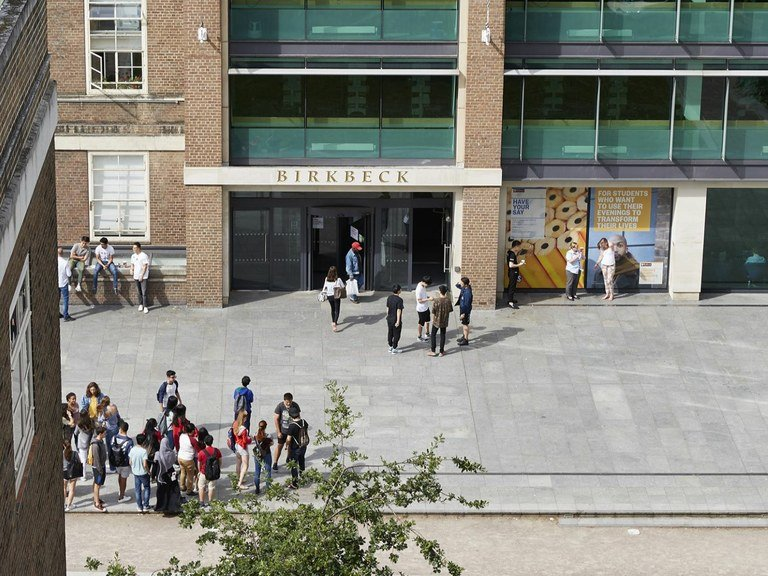

# Logistics

## Getting to the Workshop

[Home](index.md) | [Programme](programme.md) | [Logistics](logistics.md)

---

### Venue Address

**The Keynes Library**  
School of Arts, Birkbeck, University of London  
43 Gordon Square  
London WC1H 0PD  
United Kingdom

<iframe src="https://www.google.com/maps/embed?pb=!1m18!1m12!1m3!1d2482.3576789!2d-0.1318!3d51.5253!2m3!1f0!2f0!3f0!3m2!1i1024!2i768!4f13.1!3m3!1m2!1s0x48761b2f0c8e8c8b%3A0x8e7b7b7b7b7b7b7b!2s43%20Gordon%20Square%2C%20London%20WC1H%200PD!5e0!3m2!1sen!2suk!4v1234567890" width="100%" height="400" style="border:0;" allowfullscreen="" loading="lazy" referrerpolicy="no-referrer-when-downgrade"></iframe>

### How to Get There

Gordon Square is conveniently located in the Bloomsbury area of Central London and is a short walk from several major transport hubs. The nearest tube stations are:

- **Russell Square** (Piccadilly Line) — 5 minute walk
- **Euston Square** (Circle, Hammersmith & City, and Metropolitan Lines) — 7 minute walk
- **Euston** (Northern and Victoria Lines) — 10 minute walk
- **Goodge Street** (Northern Line) — 10 minute walk

### Finding the Keynes Library

The Keynes Library is located on the first floor. On entering the reception area, turn right by the lifts and take the stairs up to the first floor (or the lift). Turn left and continue along the corridor to the very end. The Keynes Library is on your right.

---

## Catering Nearby

**Terrace 5**

Birkbeck's main cafeteria, located on the 5th floor of the main building.

**Momo's Garden Café**  

A quaint coffee *hut* located inside Gordon Square.

**Birkbeck Central**  

On the ground floor of the former Student Central building.

**RADA**

It's the foyer café of the [Royal Academy of Dramatic Art](http://www.rada.ac.uk/), located just a short walk away on Malet Street.

**The Perch cafe**
Located inside the Birkbeck main building on Torrington Square.

**Dillon's**

It's inside the [Waterstone's bookshop](https://www.waterstones.com/bookshops/gower-street) on Gower Street, on the corner of Gower St. with Torrington Place.

**Lord John Russell pub**

British pub located on Marchmont St, just a short walk from Gordon Square.
[91-93 Marchmont St, London WC1N 1AL](https://maps.app.goo.gl/a7omE3oDwC8TP4To9)

**The Life Goddess Store Street**

Greek home-cooked food, located on Store Street, just a short walk from Gordon Square.

[www.thelifegoddess.com/](http://www.thelifegoddess.com/)

---

## The Keynes Library

The School of Arts has a beautifully refurbished room to commemorate one of the building's most famous residents - the celebrated economist, John Maynard Keynes.

46 Gordon Square was home to Vanessa and Virginia Stephen (both would later become famous as the artist Vanessa Bell and the writer Virginia Woolf) in the first decade of the 20th Century and when they moved, the building was occupied by Keynes. In 1925 he married the Russian Lydia Lopokova, a prima ballerina in the Diaghilev company. She moved in 1948 to Cambridge, but her housekeeper still lived in the basement flat as late as the early 1970s.

Now home to Birkbeck’s School of Arts, we are proud to remember the building’s heritage with a striking nineteenth century library named in honour Keynes. After decades of use as a teaching facility, the room has been refurbished to its former glory following a gift from Birkbeck alumna, Patsy Hickman.

In keeping with the property’s strong artistic and intellectual connections, paintings by Vanessa Bell and Duncan Grant have been loaned to Birkbeck by Bell’s daughter, Angelica Garnett, and currently grace the walls of the Keynes Library

Source: [librarything.com](https://www.librarything.com/venue/110791/The-Keynes-Library) 