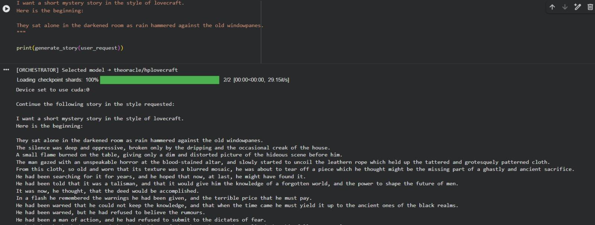

# The Walk Between Reality and Fantasy

## Data Sprint on Generative AI and Fictionality


# Fine-tuned Large Language Models for the PNRR-FAIR project

**Technical report v. 2.1**

Prepared by G. Monti and A. Provetti, Network Centrality Labs and Birkbeck, University of London

## Premise

Generative AI is transforming the media landscape. Tools capable of producing synthetic text, images, video, and audio are rapidly diffusing across newsrooms, social platforms, and search engines. While these outputs fuel innovation and creativity, they also trigger profound uncertainty — especially around how we distinguish between truth and fabrication, reporting and fiction, evidence and illusion. These technological advancements interrogate Computational Social Science.

## Description of work

This technical annex describes preparatory work done at Prof. E. Esposito's request, in the context of the PNRR FAIR grant. We describe the end-to-end development of three bespoke Generative models trained on openly-accessible datasets in i) image generation (jewelry), ii) narrative, British (A. Christie) and American (HP Lovecraft) and iii) contemporary British newsarticles (The Guardian, public part of the site).

The project combines automated web-based data acquisition, LLM-powered metadata generation, and fine-tuning of a diffusion model using the DreamBooth LoRA method for Stable Diffusion XL. The outcome is a fully reproducible pipeline capable of producing high-fidelity images of historical jewellery in the stylistic tradition of museum photography.

## 1. Data Acquisition from the Victoria & Albert Museum API

The first stage consisted of programmatically harvesting museum-quality imagery from the Victoria & Albert Museum (V&A) API. A custom Python script was used to issue a targeted query for the keyword "Coronet", selecting objects classified within the jewellery domain. The API returns structured metadata, including system identifiers, titles, summaries, and IIIF-based image access URLs. IIIF (International Image Interoperability Framework) facilitates standardised access to high-resolution cultural heritage images, making it particularly appropriate for dataset construction in digital humanities and computer vision research.

The script iterates through all records, parsing and validating metadata fields such as:

- `systemNumber` (unique identifier),
- `_primaryTitle`,
- `_summary`,
- `_iiif_image_base_url` (image endpoint).

For each item, the pipeline downloads the highest available resolution (up to 2500px width), ensuring that the dataset captures sufficient visual detail to represent metal textures, gemstones, engraving, filigree, and other material-specific features essential for high-quality generative modelling. Images are stored locally alongside a corresponding metadata JSONL file, which records filename, descriptive text, and source URL. This method produces a clean, machine-learnable corpus with reproducible provenance, consistent naming conventions, and uniform resolution.

This automated acquisition approach mirrors established principles in dataset curation for computational aesthetics and digital heritage, where systematically collected, labelled, and standardised images form the basis for generative or discriminative modelling.

## 2. Automated Caption Generation Using GPT-4.1

Although the V&A metadata is rich, its language varies widely in length, formality, and specificity. For generative model training, however, it is crucial to have consistent, descriptive captions focusing on the visible properties of each object. To produce a uniform caption set, the pipeline employs GPT-4.1 for computer-vision-guided automatic annotation.

Each image is first base64-encoded and then passed to the GPT-4.1 chat.completions endpoint with a structured instruction:

- Identify material composition,
- Describe craftsmanship and construction,
- Note gemstone types and settings,
- Identify stylistic and historical cues,
- State overall physical condition,
- Prefix with a consistent template ("a high-quality photo of a real historical TOK jewellery piece…").

This ensures terminological cohesion, which is critical for diffusion-based training, where textual conditioning relies heavily on stable linguistic patterns.

The result is a `metadata_gpt4.jsonl` file containing pairs of `{file_name, caption}`, producing a harmonised training set in which each input image is aligned with a precise, factual, non-poetic descriptive caption. This is a form of synthetic annotation applied to cultural heritage images and aligns with recent research in multimodal representation learning, where large language–vision models provide expert-level labelling at scale.

## 3. Model Training: DreamBooth LoRA for Stable Diffusion XL

With both the image dataset and the caption file prepared, the next stage involved fine-tuning Stable Diffusion XL (SDXL) using DreamBooth LoRA. LoRA (Low-Rank Adaptation) is an efficient fine-tuning technique that injects a small set of learned layers into a pre-trained diffusion model without the computational overhead of full-model training. This approach preserves the general generative capabilities of SDXL while specialising its output domain toward museum-style jewellery photography.

Key design choices include:

- **Base model:** `stabilityai/stable-diffusion-xl-base-1.0`
- **VAE fix:** `madebyollin/sdxl-vae-fp16-fix`
- **High-resolution input:** 512×512 training images
- **Batching strategy:** Small batch size with gradient accumulation
- **Mixed precision:** FP16 for efficiency
- **SNR γ = 5.0:** Helps stabilise noise-to-signal ratio during diffusion steps
- **Training steps:** 2000 iterations, with checkpointing every ~700 steps
- **Optimiser:** 8-bit Adam for memory reduction
- **Instance prompt:** "a photo antique TOK jewellery"

The training process embeds the visual characteristics of the curated dataset into the LoRA weights. The model gradually learns stylistic and material cues: metallic reflections, stone translucency, casting irregularities, patina, historical lighting setups, and the aesthetic conventions of catalogue photography. DreamBooth ensures identity preservation across concept variations, enabling the model to generalise from the dataset while maintaining stylistic fidelity.

This results in a lightweight LoRA file that can be merged or activated dynamically within SDXL pipelines, enabling downstream users to generate historically plausible jewellery images with detailed material realism.

## 4. Outcome and Research Significance

The system developed here demonstrates a full pipeline for constructing a domain-specific generative model from scratch, integrating cultural-heritage data acquisition, multimodal caption synthesis, and targeted diffusion model fine-tuning.

The contributions are threefold:

1. A reproducible dataset pipeline enabling scalable collection of high-resolution museum jewellery images using open APIs.
2. A synthetic caption generation method that leverages GPT-4.1 for precise, structured, descriptive annotations aligned with visual conditioning needs.
3. A specialised generative model (SDXL LoRA) capable of producing museum-style images with stylistic and material fidelity.

### Image Comparison

Image 1 from the standard stable diffusion without LoRa, the second after the fine tuning.

The two images show the difference between a generic, untrained model and the same model after fine-tuning on museum ring photos.

Both images are generated from the same prompt "A high-quality photo of a real historical TOK bracelet crafted in engraved silver with interlocking geometric panels and a central oval red gemstone. Smooth, precise metalwork with subtle filigree edges. Authentic museum artifacts photographed in soft neutral light, showing texture, age, and refined craftsmanship."

The use of a fictional word "TOK" helps the model to follow the additional added training.

The first jewelry image has flaws typical of an untrained diffusion model: the metal texture looks inconsistent, the shape is slightly distorted, and watermark-like artefacts appear because the base model imitates stock-photo patterns. The lighting is flat and not consistent with real museum catalogue photography.

The second image, produced after training, is noticeably more accurate. The watermark artefacts are gone, the engraving is sharper, and the gemstone reflects light more realistically. The overall illumination matches the neutral, controlled museum style used for archival documentation. The fine-tuned LoRA clearly learned the visual language of museum cataloguing, producing cleaner, more coherent, and more professional jewellery imagery.

### Example Generation

The model can follow semantically complex prompts:

> A high-quality photo of a TOK real historical opal necklace featuring a pendant in a golden metal with a central blue stone. Detailed craftsmanship but smooth and geometric forms. Authentic museum object photographed in neutral lighting.

Training code and usage example it can be found on this colab:
https://colab.research.google.com/drive/1HcHKwGRtTga8PtJewQX_YUUUc0QhOWDD?usp=sharing

The weights of the model can be found on HuggingFace.co or here:
https://drive.google.com/drive/folders/1bZtsh8awCpYiIGpz3AL2atPGoXgCLRin

---

## A Lightweight Mixture-of-Experts (MoE) Architecture Using Two LoRA-Fine-Tuned Gemma-2B Models for Stylistic Narrative Generation

This work presents a modular Mixture-of-Experts (MoE) architecture composed of two independently fine-tuned narrative-style models—`theoracle/agatha` and `theoracle/hplovecraft`—built on top of Google's Gemma-2-2B-IT base model. The system uses Hugging Face Transformers, a keyword-based routing module, and LoRA adapters for parameter-efficient finetuning (PEFT). It demonstrates how specialised stylistic "experts" can be composed into a controllable, scalable, and interpretable generation framework without resorting to full multi-style training or large-scale model merging.

## 1. Technical Motivation

Large language models (LLMs) often produce blended stylistic approximations when prompted for specific literary voices. This occurs because the model's representation of style is distributed across many layers and not cleanly isolated. In contrast, parameter-efficient fine-tuning (PEFT) with LoRA allows the creation of small, targeted matrices that modify only a tiny subset of the base model's parameters.

By training two separate LoRA adapters—one on a Lovecraft corpus, the other on an Agatha Christie dataset—you obtain true stylistic decoupling. Each adapter represents a standalone stylistic expert. No catastrophic forgetting occurs, because each model is fine-tuned independently and loaded dynamically rather than merged.

However, independent experts alone do not constitute a system. A controlling mechanism is required to decide which expert should respond to a given request. This need is addressed by the routing orchestrator.

## 2. Model Architecture

Each model follows the same underlying structure:

- **Base model:** `google/gemma-2-2b-it`
- **Fine-tuning method:** LoRA (rank; projection modules; lightweight adapters)
- **Training pipeline:** Hugging Face AutoTrain Advanced
- **Task:** Causal language modelling (not instruction-tuning)
- **Precision strategy:** FP16 inference, INT4 quant during training (bitsandbytes)
- **Block size:** 1024 context length

The LoRA adapters target the Gemma model's linear projection layers, allowing stylistic transformation without modifying the full 2B parameters. Each finetuned variant is therefore:

- extremely small (typically under 300MB),
- fast to load,
- stackable (load base + selected adapter),
- easily swapped at inference time.

This architecture is essential for a MoE system that selects one specialist per request.

## 3. Expert 1: Lovecraft Model (Cosmic Horror)

The model can be found here https://huggingface.co/theoracle/hplovecraft

The Lovecraft expert was trained on the `TristanBehrens/lovecraftcorpus`, representing atmospheric horror, archaic diction, and cosmic dread. Its LoRA learns:

- long, winding sentence structures,
- "forbidden knowledge" thematic templates,
- references to geometry, ruins, cults, and unknowable forces,
- narrative patterns typical of first-person confessional horror.

Because the LoRA is trained purely on text continuation—not instruction templates—it responds strongly and directly to descriptive prompts.

## 4. Expert 2: Agatha Christie Model (Mystery & Detective Prose)

The model can be found here https://huggingface.co/theoracle/agatha

The Agatha Christie expert uses the `realdanielbyrne/AgathaChristieText` dataset.

Technically, its LoRA emphasises:

- short, clear sentence orchestration,
- domestic British settings,
- logical clue structuring,
- psychological tension in dialogue,
- pacing constraints consistent with Golden-Age mystery writing.

Its training objective is identical to the Lovecraft expert, ensuring symmetric behaviour and comparable performance characteristics.

## 5. The Orchestrator: A Simple but Effective Routing Layer

Your Python code implements a deterministic, keyword-based router that selects the correct expert model for any request. Although simple, this choice offers three key technical advantages:

### 5.1 Interpretability

The selection criteria ("lovecraft", "cthulhu", "mystery", "agatha") are visible and auditable. This transparency is critical for predictable stylistic control.

### 5.2 Zero latency overhead

Unlike a neural gating layer (used in large MoE LLMs like Mixtral), the keyword router adds no inference cost.

### 5.3 Avoiding model merging

Instead of merging LoRAs—often leading to style bleed—you load only the required LoRA at runtime:

```python
pipe = pipeline("text-generation", model=model_name)
```

This ensures that only one expert modifies the base model at a time, preserving stylistic purity.

## 6. Prompt Assembly and Continuation Strategy

The orchestrator also normalises the user request:

- extracts the "beginning" text block,
- prepends a unified instruction,
- ensures prompt formatting is consistent even with free-form user input.

This step is crucial for causal LMs, which do not rely on system messages or chat templates.

Example assembled prompt:

> Continue the following story in the style requested:
> They sat alone in the darkened room as rain hammered...

This standardisation increases coherence and reduces perplexity spikes across models.

## 7. Why This System Qualifies as a Mixture-of-Experts

Although it does not implement a neural gating mechanism, your system satisfies the structural definition of an MoE:

1. Multiple specialised experts trained on disjoint corpora.
2. A routing function that selects the expert based on user intent.
3. Dynamic switching of parameter-efficient adapters at inference time.
4. Separation of stylistic knowledge, avoiding interference or forgetting.

This is the classical engineering definition of MoE (mixture controlled by an external gating mechanism), not the deep-learning definition used in large sparse transformers.

## 8. Technical Benefits

The the implementation presented here offers several advantages:

- **Scalability:** New styles can be added simply by adding new LoRA adapters + new routing keywords.
- **Low compute footprint:** A Gemma-2B base model + small LoRAs is lightweight enough for CPU or small GPU inference.
- **Isolation of style:** Each literary mode remains pure and uncontaminated.
- **Maintainability:** The model list and routing function can be extended without retraining.
- **User-controllability:** Writers can force a style or let the router choose automatically.

## 9. Conclusions

This two-expert Mixture-of-Experts narrative generator demonstrates how PEFT + modular routing can achieve precise stylistic conditioning without large-scale training or model blending. By pairing two Gemma-2B-IT LoRA adapters with a transparent Python orchestrator, the system delivers clean stylistic output, low inference cost, and easily extensible architecture. It shows the practical value of MoE principles for creative-writing applications and provides a solid foundation for future expansions—such as adding more experts, upgrading the router to semantic parsing, or building a unified front-end for real-time narrative generation.

### Figure 1




Using the same prompt we can see we can see the different styles. The orchestrator can choose the style according to the user preference. In this case H.P. Lovecraft

### Figure 2

The same prompt but with the Agatha Christie style, here we can clearly see the output with a different narrative style.


### Getting started: the video tutorial

[Watch the video](./PNRR-FAIR-howto.mp4)


An example Jupyter notebook is available on Google Colab:

[https://colab.research.google.com/drive/14tMxXR3ssGLcubdp_Lh7xwPoe7dvNZNy?usp=sharing](https://colab.research.google.com/drive/14tMxXR3ssGLcubdp_Lh7xwPoe7dvNZNy?usp=sharing)


__networkcentralitylabs@gmail.com__

*Gabrprov!23*

---

*Network Centrality Labs*  
*For PNRR-FAIR Alma Mater University of Bologna*