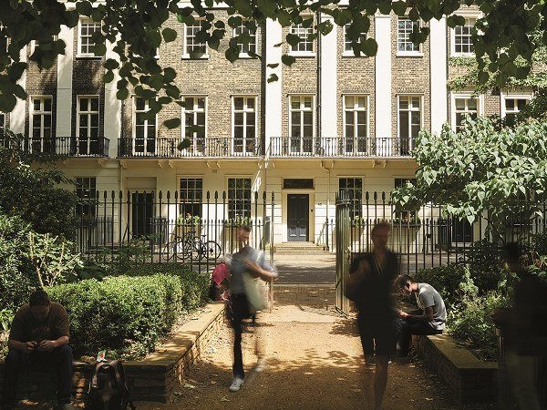

# The Walk Between Reality and Fantasy

## An International Workshop

[Home](index.md) | [Programme](programme.md) | [Logistics](logistics.md)

---

**Birkbeck, University of London**  
**Thursday 8 - Friday 9, January 2026**

The proliferation of AI systems capable of generating synthetic text, images, audio, and video is transforming how public knowledge is constructed and how truth is contested. These systems produce content that is realistic in form, but detached from factual grounding — effectively creating a novel kind of algorithmic fiction. Traditional models of information ("news stories") and mis/disinformation ("fake news") are no longer sufficient to capture the nuances of synthetic content that mimics journalistic realism. As semiotics teaches us, fiction is not a lie — it operates under a different contract than reportage. But when AI-generated artifacts take on journalistic form, that contract becomes ambiguous. We focus on a core property of fiction: fiction is realistic, but not real. It generates coherent, plausible worlds that refer to reality without being bound by it. In the age of Generative AI, this fictionality becomes a technical feature — one that is produced at scale, detached from intention, and embedded in digital media.

---

## Wednesday 7 January

**7:30 PM — Informal Dinner**  
[Franco Manca, Tottenham Court Road](https://www.francomanca.co.uk/restaurants/tottenham-court-road/)

(Please let us know if you will be attending)

---

## Thursday 8 January: Exploration and Experimentation

**Venue:** [The Keynes Library, Gordon Square 43, London WC1H 0PD, UK](https://www.bbk.ac.uk/school/creative-arts-culture-and-communication/buildings-and-facilities)

### 9:30 - 10:30 | Introduction
**Elena Esposito, Alessandro Provetti, Federico Pilati**

Overview of the aims for the workshop and introduction to the custom large language models developed specifically for the event (trained respectively on: visual collections from the British Museum, English narrative texts from the Project Gutenberg corpus, and journalistic articles from *The Guardian*).

### 10:30 - 11:00 | Coffee Break

### 11:00 - 12:30 | Collective Mapping of Key Questions
**Elena Esposito**

- Distinctions between fiction, factuality, and journalistic realism in AI-generated content
- Textual, visual, and structural cues of credibility or fictionality
- Emerging social, epistemic, and political implications of algorithmic fiction

### 12:30 - 13:00 | Synthesis and Formation of Working Groups

Definition of thematic teams (text, image, news realism; speculative design; digital methods).

### 13:00 - 14:00 | Lunch

### 14:00 - 16:00 | Laboratory 1: Testing and Manipulating the Specialised LLMs
**Alessandro Provetti**

Hands-on exploration with the three workshop models:

- Generating "realistic news forms" under controlled prompting
- Comparing human-created and AI-generated texts and images
- Identifying markers of fictionality (rhetorical, structural, or visual)

### 16:00 - 16:30 | Coffee Break

### 16:30 - 18:00 | Laboratory 2: Early Prototyping
**Alessandro Provetti**

Teams develop initial concepts and artefacts, such as:

- "Literacy devices" or experimental interventions
- Analytical tools, visualisations, exploratory prototypes
- Preliminary frameworks for classifying algorithmic fictionality

### 19:30 | Workshop Dinner
[The Life Goddess, Store St.](https://www.thelifegoddess.com/)

(Please let us know if you will be attending)

---

## Friday 9 January: Deepening, Training, and Collective Output

**Venue:** [The Keynes Library, Gordon Square 43, London WC1H 0PD, UK](https://www.bbk.ac.uk/school/creative-arts-culture-and-communication/buildings-and-facilities)

### 9:30 - 11:00 | Re-Brainstorming Session
**Elena Esposito**

Reflective discussion on day one outputs and refinement of research questions.

### 11:00 - 11:15 | Coffee Break

### 11:15 - 13:00 | Laboratory 3: Real-Time Training and Model Adaptation
**Alessandro Provetti**

- Adding instructions or annotated data to one or more LLMs
- Lightweight fine-tuning and rapid model adaptation
- Tracing shifts in style, factual grounding, and fictionality cues

### 13:00 - 14:00 | Lunch

### 14:00 - 15:30 | Collaborative Report Writing

Teams contribute sections to a shared workshop report:

- Interpretive reflections
- Empirical results from model testing
- Methodological or design-oriented proposals

### 15:30 - 16:30 | Presentation and Discussion of Reports
**Elena Esposito, Alessandro Provetti, Federico Pilati**

### 16:30 - 17:00 | Coffee Break

### 17:00 - 18:30 | Roundtable: Final Public Debate

Open session for the broader University of London community, presenting interim findings followed by discussion and Q&A.

---

## Saturday 10 January: Follow-up (Voluntary)

**9:30 AM — Breakfast**  
[Birkbeck Central Wellness Space, Malet Street](https://www.bbk.ac.uk/prospective/our-campus/campus-buildings)

---

## Participants

- **Alessandro Provetti** — Birkbeck, University of London
- **David Stark** — Columbia University
- **Elena Esposito** — Bielefeld University & University of Bologna
- **Emma Garzonio** — University of Rome
- **Federico Pilati** — University of Bologna
- **Joel Mckim** — Birkbeck, University of London
- **Marco Solaroli** — University of Bologna
- **Nathaniel Tkacz** — Goldsmiths, University of London
- **Paul Nulty** — Birkbeck, University of London
- **Scott Rodgers** — Birkbeck, University of London
- **Tim Markham** — Birkbeck, University of London